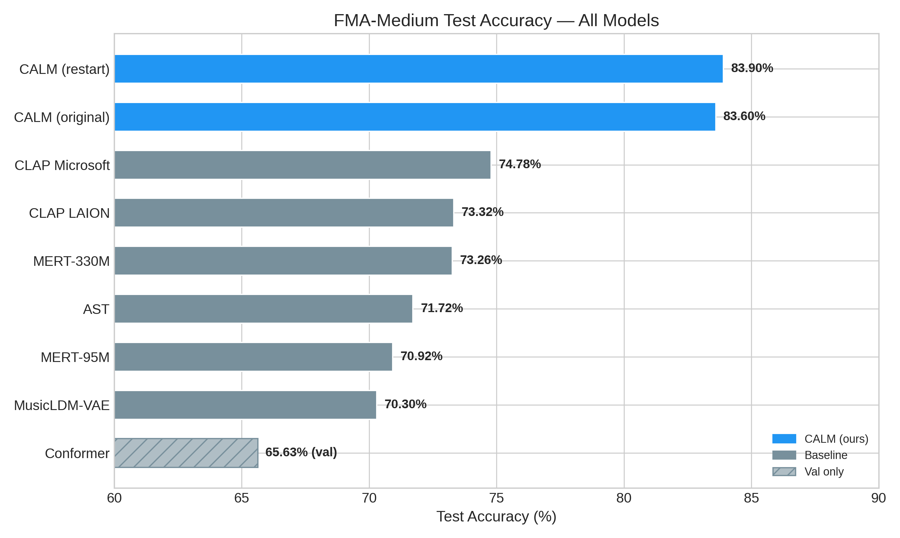
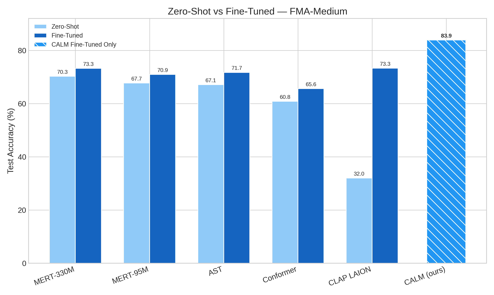
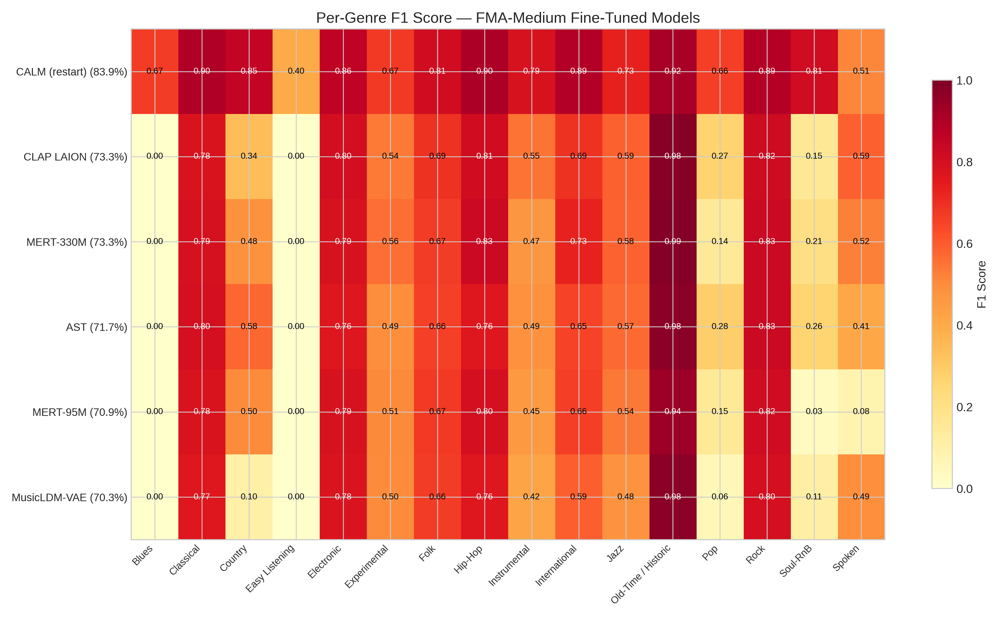
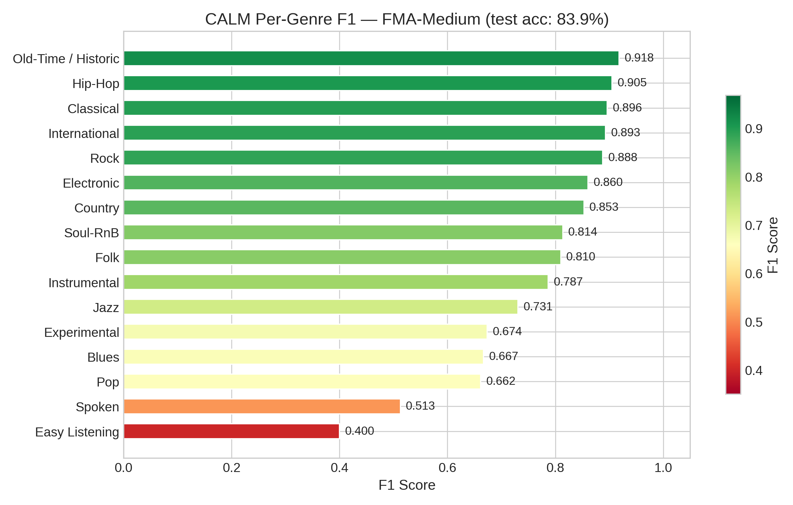
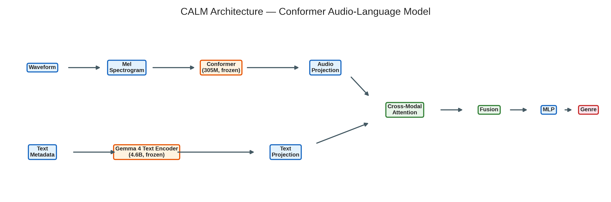
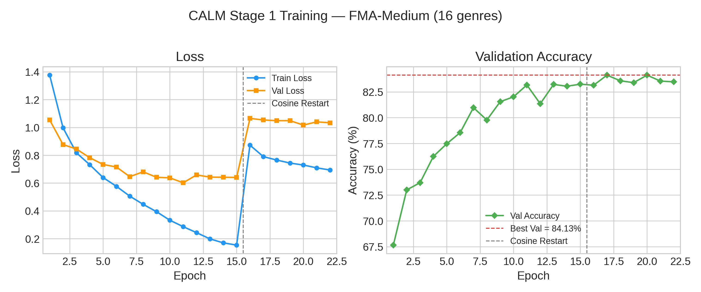
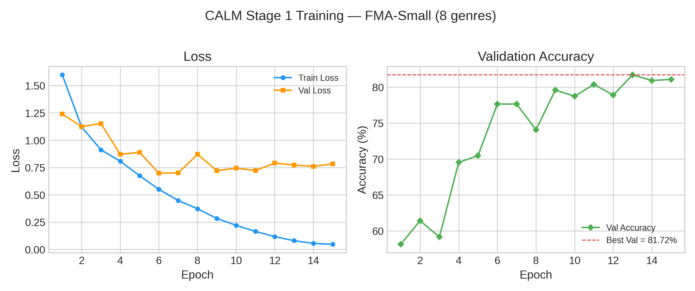

---
# Music Genre Classification with Pre-trained Audio Models and Multimodal Fusion

**Course:** CS5100 -- Foundations of Artificial Intelligence  
**Institution:** Northeastern University  
**Term:** Spring 2026  
**Author:** Anand Thakkar  

*This PDF was converted from `results/reports/PROJECT_REPORT.md` in the project repository.*

---

## 1. Introduction

Automatic music genre classification is a long-standing task in music information retrieval (MIR). Recent advances in self-supervised and contrastive pre-training have produced powerful audio encoders, yet most approaches classify based on audio alone -- ignoring readily available textual metadata (artist name, biography, track title) that humans routinely use to contextualize music.

This project makes two contributions:

1. **A systematic comparison** of six pre-trained audio encoders -- MERT, CLAP, AST, MusicLDM-VAE, and Wav2Vec2-Conformer -- under zero-shot and fine-tuned evaluation on the Free Music Archive (FMA).
2. **CALM (Conformer Audio-Language Model)**, a novel multimodal architecture that fuses Gemma 4's audio Conformer with its text encoder via cross-modal attention, achieving **83.9% test accuracy** on FMA-Medium -- a **+9.1 pp improvement** over the best audio-only baseline with only **4M trainable parameters**.

---

## 2. Objectives

- Compare **discriminative** (MERT, AST), **multimodal contrastive** (CLAP), **generative** (MusicLDM-VAE), and **speech-pretrained** (Conformer) encoders on the same train/val/test splits.
- Measure **zero-shot** performance (linear probe on frozen embeddings) versus **fine-tuned** performance (encoder + head, with early stopping).
- Design and evaluate **CALM**, a multimodal model that incorporates textual metadata alongside audio features for genre classification.

---

## 3. Datasets

| Subset | Tracks | Genres | Role |
|--------|:------:|:------:|------|
| **FMA-Small** | 8,000 | 8 | Initial benchmark (balanced classes) |
| **FMA-Medium** | 25,000 | 16 | Primary evaluation (imbalanced, more realistic) |
| **Bollywood** | 153 | 6 sub-genres | Out-of-distribution evaluation |

All audio is converted to **16 kHz mono WAV** via `data/preprocess_audio.py` (FMA-Small: 7997/8000 ok; FMA-Medium: 25000/25000). Metadata is loaded from FMA-style `tracks.csv` / `genres.csv`. Large audio trees and checkpoints are gitignored.

---

## 4. Models

| Model | Type | Parameters | Native SR | Source |
|-------|------|:----------:|:---------:|--------|
| MERT-95M | Music SSL | 95M | 24 kHz | `m-a-p/MERT-v1-95M` |
| MERT-330M | Music SSL | 330M | 24 kHz | `m-a-p/MERT-v1-330M` |
| CLAP (LAION) | Audio-text contrastive | 100M+ | 48 kHz | `laion/clap-htsat-fused` |
| CLAP (Microsoft) | Audio-text contrastive | 100M+ | 44.1 kHz | `msclap` package |
| AST | Audio spectrogram transformer | 87M | 16 kHz | `MIT/ast-finetuned-audioset` |
| MusicLDM-VAE | Generative encoder | ~80M | 16 kHz | `ucsd-reach/musicldm` |
| Conformer | Speech SSL | 600M | 16 kHz | `facebook/wav2vec2-conformer-rel-pos-large` |
| **CALM (ours)** | **Audio-language fusion** | **~4M trainable** | **16 kHz** | **Gemma 4 E2B encoders** |

---

## 5. Experimental Protocol

- **Fine-tuning:** AdamW optimizer with separate learning rates for backbone and classification head. Cosine learning rate scheduling. Early stopping on validation accuracy (patience = 5).
- **Temporal sampling:** Random 5-second crops during training; deterministic center crops for validation/test. Optional multi-crop test averaging for CLAP.
- **Metrics:** Test accuracy and per-class F1 score on held-out test set. All runs produce structured JSON results with `test_accuracy`, `best_val_accuracy`, and `per_class_f1`.

---

<div style="page-break-before: always;"></div>

## 6. Results

### 6.1 FMA-Medium -- Model Comparison



*Figure 1: Test accuracy on FMA-Medium (16 genres) for all evaluated models. CALM (ours) achieves 83.9%, surpassing the best audio-only baseline (CLAP Microsoft, 74.78%) by +9.1 pp.*

&nbsp;

| Model | Test Acc. | Best Val Acc. | Epochs | Notes |
|-------|:---------:|:-------------:|:------:|-------|
| **CALM (restart)** | **83.90%** | **84.13%** | 22 | Cosine restart + label smoothing 0.1 |
| **CALM (original)** | **83.60%** | **83.25%** | 15 | Stage 1, ~4M trainable params |
| CLAP (Microsoft) | 74.78% | 74.68% | 10 | 7 s clips, 2-segment average |
| CLAP (LAION) | 73.32% | 72.15% | 11 | Multi-crop test (hop=0.5) |
| MERT-330M | 73.26% | 74.32% | 8 | |
| AST | 71.72% | 72.72% | 7 | |
| MERT-95M | 70.92% | 72.30% | 10 | |
| MusicLDM-VAE | 70.30% | 68.57% | 50 | Mel augment, unfreeze depth 3 |
| Conformer | -- | 65.63% | 26 | Val only; early-stopped |

&nbsp;

<div style="page-break-before: always;"></div>

### 6.2 Zero-Shot vs Fine-Tuned



*Figure 2: Comparison of zero-shot (linear probe) and fine-tuned performance on FMA-Medium. CLAP LAION shows the largest gain (+41.3 pp), while CALM (fine-tuned only) sets the overall ceiling at 83.9%.*

&nbsp;

<div align="center">

| Model | Zero-shot | Fine-tuned | Delta |
|-------|:---------:|:----------:|:-----:|
| MERT-330M | 70.26% | 73.26% | +3.0 pp |
| MERT-95M | 67.74% | 70.92% | +3.2 pp |
| AST | 67.08% | 71.72% | +4.6 pp |
| Conformer | 60.84% | 65.63% | +4.8 pp |
| CLAP (LAION) | 32.02% | 73.32% | **+41.3 pp** |
| **CALM** | -- | **83.90%** | -- |

</div>

&nbsp;

<div style="page-break-before: always;"></div>

### 6.3 Per-Genre F1 Analysis



*Figure 3: Per-genre F1 scores across all fine-tuned models on FMA-Medium. CALM (top row) shows consistently higher F1 across genres, with notable improvements in rare genres like Blues, Soul-RnB, and Country.*

&nbsp;



*Figure 4: CALM per-genre F1 breakdown on FMA-Medium (test acc: 83.9%). Old-Time/Historic (0.92) and Hip-Hop (0.91) are strongest; Easy Listening (0.40) and Spoken (0.51) are weakest, consistent with low test-set support.*

&nbsp;

### 6.4 FMA-Small Results

| Model | Zero-shot | Fine-tuned |
|-------|:---------:|:----------:|
| MERT-95M | 58.41% | 63.12% |
| MERT-330M | 62.41% | 66.06% |
| CLAP (LAION) | 12.50% | 63.75% |
| AST | 55.25% | 64.94% |
| MusicLDM-VAE | 50.06% | 56.87% |
| **CALM (no_tags)** | -- | **81.44%** |

CALM surpasses MERT-330M (previous best) by **+15.4 pp** on FMA-Small.

---

## 7. CALM -- Conformer Audio-Language Model

### 7.1 Motivation

All baseline models process audio in isolation -- they ignore readily available metadata (artist name, biography, track title) that could disambiguate genres. A sitar riff alone could be Folk, International, or Experimental; adding "Indian playback singer" narrows it immediately. We designed CALM to fuse audio representations with textual metadata via cross-modal attention, leveraging Gemma 4's multimodal architecture.

&nbsp;

### 7.2 Architecture



*Figure 5: CALM architecture. Audio waveforms are processed by a frozen Gemma 4 Conformer (305M params), while text metadata passes through a frozen Gemma 4 text encoder (4.6B params). Learned projection layers and cross-modal attention (2 layers) fuse the two modalities before a classification MLP. Only ~4M parameters are trained.*

&nbsp;

```
Audio path:   Waveform -> Mel Spectrogram -> Conformer (305M, frozen)
              -> [B, 125, 1536] -> Linear+LayerNorm -> [B, 125, 512]
                                                            |
                                                 Cross-Modal Attention (x2)
                                                            |
Text path:    Metadata -> Gemma 4 Text Encoder (4.6B, frozen)
              -> mean pool -> [B, 1536] -> Linear+LayerNorm -> [B, 1, 512]

Fusion:       Mean-pool audio [B,512] + Squeeze text [B,512]
              -> Concat [B, 1024] -> LayerNorm -> MLP -> [B, num_genres]
```

&nbsp;

**Key design decisions:**

- **Both encoders from Gemma 4 E2B:** Same model family ensures compatible representation spaces. Audio Conformer trained on multilingual YouTube audio; text backbone handles 140+ languages.
- **Cross-modal attention, not concatenation:** Audio tokens (125 frames) attend to the text token, and vice versa -- learning which audio features matter given the textual context.
- **Frozen encoders (Stage 1):** Only ~4M trainable parameters (projections + cross-attention + MLP head). Training takes ~5 min/epoch on RTX 5060 Ti.
- **Text embeddings pre-computed:** Gemma 4 text backbone encodes all 25k descriptions once (~4 min), saved to disk. Training never loads the text model.

&nbsp;

### 7.3 Text Data Pipeline

Three text variants for ablation:

| Variant | Content | Leakage Risk |
|---------|---------|:------------:|
| `no_tags` (default) | Artist name + biography + track title | Low |
| `with_tags` | Above + artist tags (e.g., "hip-hop, electronic") | High |
| `lyrics` | Song lyrics (via LRCLIB + lyrics.ovh + Genius + AZLyrics) | None |

&nbsp;

### 7.4 Training Dynamics



*Figure 6: CALM Stage 1 training on FMA-Medium. Left: training and validation loss. Right: validation accuracy. The vertical dashed line marks the cosine restart at Epoch 16 (with label smoothing 0.1). Best validation accuracy of 84.13% is reached at Epoch 17.*

&nbsp;



*Figure 7: CALM Stage 1 training on FMA-Small. Best validation accuracy of 81.72% at Epoch 13. The model converges faster on the smaller dataset.*

&nbsp;

### 7.5 Summary of Results

| Dataset | Test Acc | Best Val | Epochs | Trainable Params |
|---------|:--------:|:--------:|:------:|:----------------:|
| **FMA-Medium** (original) | 83.60% | 83.25% | 15 | ~4M |
| **FMA-Medium** (cosine restart) | **83.90%** | **84.13%** | 22 (early-stopped) | ~4M |
| **FMA-Small** (original) | **81.44%** | 81.72% | 15 | ~4M |
| **FMA-Small** (cosine restart) | -- | 80.23% | 20 (early-stopped) | ~4M |

&nbsp;

**Key findings:**

- **+9.1 pp** over CLAP Microsoft (previous best, 74.78%) on FMA-Medium
- **+15.4 pp** over MERT-330M (previous best, 66.06%) on FMA-Small
- **+18.3 pp** over Conformer audio-only (65.63%)
- Cosine restart with label smoothing yields **+0.3 pp** test / **+0.88 pp** val on FMA-Medium
- Cosine restart did **not** improve on FMA-Small (80.23% vs original 81.72%), likely due to limited dataset size
- Achieves all this with only **~4M trainable parameters** (vs 100M+ for CLAP, 330M for MERT)

Further ablation experiments (text variants, Stage 2 unfreezing, lyrics fusion) are documented in the ablation study research plan.

---

## 8. Additional Extensions

- **Conformer (Wav2Vec2):** Speech-pretrained model (`facebook/wav2vec2-conformer-rel-pos-large`) fine-tuned on FMA-Medium. Despite domain mismatch (speech to music), achieves 60.84% zero-shot and 65.63% fine-tuned.
- **Lyrics pipeline:** `data/build_lyrics_cache_multi.py` fetches lyrics from 4 APIs (LRCLIB, lyrics.ovh, Genius, AZLyrics) with fallback chain. Currently scraping FMA-Medium (~260/25k tracks).
- **Bollywood dataset:** 153 tracks from personal collection with metadata extracted from ID3 tags. Sub-genres: bollywood_pop (103), hindi_hiphop (23), remix/mashup (9), devotional/folk (6), gujarati/garba (4), punjabi_pop (4).
- **Audio preprocessing:** Converts FMA MP3s to 16kHz mono WAV, eliminating decoding errors at training time.

---

## 9. Reproducibility

```bash
conda activate torch
pip install -r requirements.txt

# Fine-tune CALM on FMA-Medium:
python models/calm/finetune.py --dataset medium --stage 1 --run_tag no_tags \
    --epochs 15 --batch_size 8 --grad_accum 8

# Evaluate a CALM checkpoint:
python models/calm/zero_shot.py --dataset medium \
    --calm_ckpt results/checkpoints/calm/calm_ET_83.25_medium.pt

# Run all baseline zero-shot evaluations:
python evaluate.py --dataset medium --models mert-330m mert-95m ast clap-laion
```

Set `FMA_BASE_DIR` if audio/metadata live outside the repo default. All training logs are saved to `results/logs/finetune/*.csv` and structured results to `results/runs/*.json`.

---

## 10. Remaining Work

| # | Item | Status |
|---|------|--------|
| 1 | CALM cosine-restart | **Done.** Medium: +0.3 pp (83.9%). Small: no improvement. |
| 2 | CALM text ablation study (5 variants) | Planned -- see ablation study research plan |
| 3 | FMA-Medium lyrics extraction | In progress (~260/25k tracks, ~11% hit rate) |
| 4 | Bollywood zero-shot evaluation | Planned (153 OOD tracks) |

**For real research impact:** An ablation study is in progress to disentangle the contributions of different text modalities -- artist metadata vs. song lyrics vs. artist tags -- and to quantify genre leakage risk. Stage 2 fine-tuning (unfreezing the Conformer) and out-of-distribution evaluation on a 153-track Bollywood dataset are planned as additional validation of CALM's generalization capabilities.

---

## 11. Conclusion

We presented a systematic comparison of six pre-trained audio models for music genre classification on FMA, and introduced **CALM**, a novel multimodal architecture that fuses Gemma 4's audio Conformer with its text encoder via cross-modal attention. CALM achieves **83.9% test accuracy** on FMA-Medium (16 genres) with only **4M trainable parameters** -- surpassing all audio-only baselines by **+9.1 pp**. The results demonstrate that incorporating textual metadata (artist name, biography, track title) provides substantial discriminative signal that pure audio models miss, particularly for ambiguous or underrepresented genres.

---

## Works Cited

[1] M. Defferrard, K. Benzi, P. Vandergheynst, and X. Bresson, "FMA: A Dataset for Music Analysis," in *Proc. International Society for Music Information Retrieval Conference (ISMIR)*, 2017. arXiv:1612.01840.

[2] A. Gulati, J. Qin, C.-C. Chiu, N. Parmar, Y. Zhang, J. Yu, W. Han, S. Wang, Z. Zhang, Y. Wu, and R. Pang, "Conformer: Convolution-augmented Transformer for Speech Recognition," in *Proc. Interspeech*, 2020. arXiv:2005.08100.

[3] Y. Li, R. Yuan, G. Zhang, Y. Ma, X. Chen, H. Yin, C. Xiao, C. Lin, A. Ragni, E. Benetos, N. Gyenge, R. Dannenberg, R. Liu, W. Chen, G. Xia, Y. Shi, W. Huang, Z. Wang, Y. Guo, and J. Fu, "MERT: Acoustic Music Understanding Model with Large-Scale Self-supervised Training," in *Proc. International Conference on Learning Representations (ICLR)*, 2024. arXiv:2306.00107.

[4] B. Elizalde, S. Deshmukh, M. Al Ismail, and H. Wang, "CLAP: Learning Audio Concepts from Natural Language Supervision," in *Proc. IEEE International Conference on Acoustics, Speech and Signal Processing (ICASSP)*, 2023. arXiv:2206.04769.

[5] Y. Gong, Y.-A. Chung, and J. Glass, "AST: Audio Spectrogram Transformer," in *Proc. Interspeech*, 2021. arXiv:2104.01778.

[6] Y. Wu, K. Chen, T. Zhang, Y. Hui, T. Berg-Kirkpatrick, and S. Dubnov, "Large-scale Contrastive Language-Audio Pretraining with Feature Fusion and Keyword-to-Caption Augmentation," arXiv:2211.06687, 2023. (LAION-CLAP)

[7] Google DeepMind, "Welcome Gemma 4," Hugging Face Blog, 2025. [Online]. Available: https://huggingface.co/blog/gemma4
